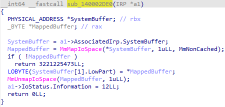
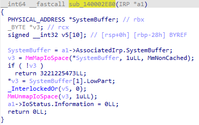

# Vulnerable signed driver - Arbitary memory and I/O port Read/Write

## Overview
This repository documents a signed vulnerable driver that has not yet been added to the vulnerable driver blocklist. It is still being exploited today.

> **Example:** Example is shown in the [kproc.c](src/TPwSav-POC/kproc.c) file by finding the base address of the System process, traversing the `ActiveProcessLinks` to find the EPROCESS structure based on a PID (it's very slow)

### Arbitrary memory read
Looking at this pseudo-code generated by IDA we can already tell that this driver is poorly written, it has no input validation at ALL.

It uses `MmMapIoSpace` to map the physical memory address to the virtual address space.
All we have to do is construct an array of 2 `LARGE_INTEGER`(s). The first entry should contain the physical address of the value we want to read from. After calling the specific IO Control code to the driver we can check the `LARGE_INTEGER[1].LowPart` and we'll notice that the value is actually there.



### Arbitrary memory write
They're practically the same, except that this function expects a value in the `LARGE_INTEGER[1].LowPart` (1 byte) that will be written to the physical address.

See how arbitrary memory read/write is implemented in [physrw.c](src/TPwSav-POC/physrw.c)




### Arbitrary I/O port write
The function expects an array of 2 `DWORD`(s), the first one is the I/O port you want to write to (1 byte in this image). The second one contains the value you want to write to the I/O port.

This driver has multiple functions like this (byte, word, dword), I'm showing only one example both here and in the code.

You can try it by writing the value **0x0E** to port **0xCF9** which causes a warm system reset (a restart).

See how arbitrary I/O port write is implemented in [ioutil.c](src/TPwSav-POC/ioutil.c)


### Translating Kernel Virtual-Address to Physical-Address
We do this by abusing `Superfetch`, a legitimate kernel module that exposes Virtual to Physical address translation functionality using undocumented APIs.

See how virtual memory translation is implemented in [vtop.c](src/TPwSav-POC/vtop.c)


## How to use

You can compile this project yourself, it reads the `EPROCESS`'s `UniqueProcessId` field by resolving the `EPROCESS` structure of the System Process using `PsInitialSystemProcess`.
> **Warning:** Everything was tested on Windows build 24H2. The offsets in the `EPROCESS` structure might be different on your system.


```powershell
cmake . --preset Debug
cmake --build --preset Debug
.\bin\Debug\TPwSav.exe
```

You can find the driver binary in this current directory.

```powershell
sc create TPwSav binPath="<Path>" type=kernel
sc start TPwSav
```

## References
https://github.com/jonomango/superfetch

https://www.loldrivers.io/drivers/c0634ed7-840e-4a7e-8b34-33efe50405c2


